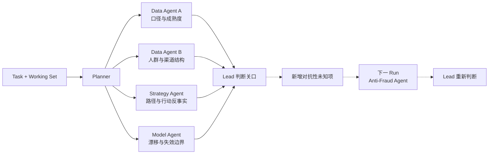
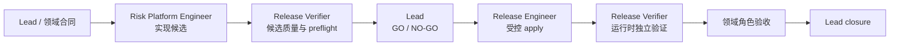

# 一次脱敏的风险管理协作

> Arion 不是在分配工作，而是在组织一个集体判断如何形成、承担质疑，并被现实持续修正。

这是一份从 Arion 原始风险管理项目中抽取出来的结构化示例。

它保留：

- 风险问题如何进入 Working Set；
- 不同角色为什么不能互相替代；
- 哪些 Agent 可以并行，哪些关系才是真依赖；
- Lead 如何形成一个可承担、可修正的判断；
- 判断如何进入工程实现、受控行动和独立验证；
- 新的现实如何重新打开旧判断。

它不包含：

- 任何公司、客户或产品名称；
- 真实指标定义、阈值、样本、规则和模型；
- 数据源、表名、系统地址或内部基础设施；
- 私有提示词、角色知识、事故经验或发布命令。

文中的数值方向和结论均为虚构，只用于解释 Arion 的协作结构。

## 1. 问题

假设一个风险团队观察到：

> 某项准入策略调整后，通过率上升了；与此同时，一个尚未完全成熟的早期风险信号也在上升。团队需要决定：继续扩大、保持当前范围，还是回退？

这不是一个“让分析师出一份报告”的任务，因为它同时包含几个不可约问题：

1. 这个变化是否真实，还是来自口径、时间窗或人群结构变化？
2. 哪条策略路径可能造成了变化？
3. 模型、特征或样本漂移是否改变了原有风险排序？
4. 如果继续扩大或立即回退，哪一种错误代价更高？
5. 当前证据是否足以采取行动，还是只能形成观察义务？

## 2. 先建立 Task，而不是先画流程

Task 保存长期问题、验收边界和责任：

```yaml
task:
  objective: 判断当前准入调整是否可以继续扩大
  user_intent: 在增长收益与未来风险之间形成可承担的决定
  accountable_owner: Lead
  acceptance_boundary:
    - 指标分子、分母、时间窗与成熟度必须明确
    - 人群结构变化必须与策略效果分开
    - 行动与不行动的后果必须同时比较
    - 所有未成熟风险都必须留下观察义务
```

此时不要预设：

```text
Data -> Strategy -> Model -> Lead
```

先把当前经验和未知写入 Working Set：

```yaml
working_set:
  observed_experience:
    - statement: 最近窗口的通过率高于调整前
      status: provisional
    - statement: 一个早期风险信号同步上升
      status: provisional

  unknowns:
    - item_id: U1
      statement: 调整前后分子、分母和成熟窗口是否可比
      required_next_owner: Data Analyst
    - item_id: U2
      statement: 人群与渠道结构变化能否解释表面差异
      required_next_owner: Data Analyst
    - item_id: U3
      statement: 哪条规则或决策路径变化能够解释结果
      required_next_owner: Strategy Analyst
    - item_id: U4
      statement: 模型、特征、样本和版本是否仍然可比
      required_next_owner: Model Engineer

  competing_hypotheses:
    - hypothesis: 策略调整真实地扩大了风险暴露
    - hypothesis: 风险变化主要来自人群结构改变
    - hypothesis: 模型或特征漂移削弱了原有排序
    - hypothesis: 早期信号尚未成熟，当前差异会回归

  counterfactuals:
    - hypothesis: 如果不扩大，未来成熟风险可能保持稳定
    - hypothesis: 如果立即回退，可能放弃本可接受的增量

  asymmetric_consequences:
    - action: 继续扩大
      possible_cost: 错误放大未来损失，且结果较晚才能观察
    - action: 立即回退
      possible_cost: 错误放弃有效增长，但通常更容易恢复
```

这些内容不是结论。它们只是系统当前承认的经验、未知和可检验解释。

## 3. 哪些角色被激活

Arion 原始风险组装中有八个治理角色，但这个问题不会自动激活全部角色。

### 本轮直接激活

| 角色 | 本轮不可约问题 |
| --- | --- |
| `Data Analyst` | 现象是否成立，口径、成熟度、样本与影响范围是什么 |
| `Strategy Analyst` | 哪条决策路径能够解释变化，行动反事实是什么 |
| `Model Engineer` | 模型、特征、样本和版本的失效边界在哪里 |
| `Lead` | 当前集体判断是什么，谁承担它，什么现实会迫使修正 |

### 条件激活

`Anti-Fraud Specialist` 不因为“风险上升”四个字就自动参加。只有当 Data 或 Strategy 发现明显的集中、关联、时序或规避信号时，才新增一个有界问题：

> 当前变化是否更像对抗性适应，而不是正常流量、策略或技术变化？

### 尚不激活

以下角色只有在 Lead 最终批准了工程或现实行动后才出现：

- `Risk Platform Engineer`；
- `Release Engineer`；
- `Release Verifier`。

这体现了一个关键原则：

> 角色注册表定义谁可以承担责任，不代表每次运行谁都必须出场。

## 4. Planner 生成的不是固定角色链

当前有四个可以独立开始的未知项：

- 两个属于 `Data Analyst`；
- 一个属于 `Strategy Analyst`；
- 一个属于 `Model Engineer`。

Planner 因此可以为同一个 `Data Analyst` 创建两个 Agent 实例，而不增加新的治理角色。



这里使用 TaskGraph，不是因为“风险分析必须复杂”，而是因为：

- 存在多个独立任务；
- 同一角色需要多个并行 Agent；
- 最终需要一个由 Lead 承担的判断关口；
- 新证据可能产生下一次 Run 的 Anti-Fraud Agent。

如果 Working Set 只有一个明确的数据口径问题，就应该退化为一个 `Data Analyst` Direct Run。

TaskGraph 在注册后保持确定，不会在执行中偷偷增加节点。如果本轮发现对抗性证据，Lead 先把新的未知项写回 Working Set，再由下一次 planner 调用创建新的 Anti-Fraud Agent。

## 5. 每个 Agent 收到什么

### Data Agent A：口径与成熟度

```yaml
objective: 验证调整前后指标是否可比
questions:
  - 分子与分母是否一致
  - 观察窗口与成熟窗口是否一致
  - 缺失、延迟或选择性进入是否改变结论
outputs:
  - observed_experience
  - evidence_boundary
  - unknowns
  - revision_triggers
stop_point: 事实与口径边界足以支持后续判断
```

它不能直接说“策略应该回退”，因为那已经越过事实责任。

### Data Agent B：人群结构

```yaml
objective: 判断结构变化能否解释表面差异
questions:
  - 主要人群、渠道或风险层占比是否改变
  - 控制结构后，方向是否仍然存在
outputs:
  - segment_evidence
  - selection_effect_boundary
  - unexplained_residual
```

两个 Data Agent 可以并行，因为它们回答不同问题；最终证据责任仍属于同一个 `Data Analyst` 治理角色。

### Strategy Agent：策略解释与行动反事实

```yaml
objective: 构造不同动作可能带来的未来路径
questions:
  - 哪条规则、阈值或决策路径变化可以解释当前经验
  - 扩大、保持和回退分别有什么非对称后果
  - 什么证据会反驳当前策略解释
outputs:
  - strategy_explanation
  - action_counterfactuals
  - asymmetric_consequences
```

它可以先构造假设，但在 Data 证据返回前不能把假设写成事实。

### Model Agent：模型与失效边界

```yaml
objective: 判断模型证据是否支持或排除当前主假设
questions:
  - 模型、特征、样本与版本身份是否可比
  - 当前变化更像漂移、校准偏移还是适用边界变化
  - 哪个未来检验能够反驳模型解释
outputs:
  - model_evidence
  - uncertainty_boundary
  - falsification_test
```

它不替代 Strategy Agent 做规则归因，也不把“分数变化”直接等同于“风险变化”。

## 6. 角色输出如何合成判断

假设这轮虚构探究得到：

### 已观察事实

- 在统一分母和窗口后，通过率上升仍然存在；
- 人群结构变化可以解释一部分差异，但不能解释全部；
- 早期风险信号方向存在，但结果尚未完全成熟；
- 模型版本一致，存在轻微分布变化，但尚不足以证明模型失效。

### 当前解释

- 策略调整很可能贡献了增量；
- 风险抬升可能同时包含策略暴露与结构变化；
- 现有证据不足以量化最终成熟损失；
- 没有足够证据支持对抗性欺诈解释，因此不激活 Anti-Fraud Specialist。

### 行动反事实

| 候选动作 | 如果判断正确 | 如果判断错误 |
| --- | --- | --- |
| 继续扩大 | 获得更多有效增量 | 在成熟结果出现前放大不可逆风险 |
| 保持当前范围 | 获得更多观察时间 | 延迟潜在有效增长 |
| 立即回退 | 快速收缩风险暴露 | 放弃可能健康的增量，且干扰后续归因 |

Lead 不是把四份输出拼成摘要，而是承担一个选择。

一个可能的虚构判断是：

```yaml
current_judgment:
  status: closed
  statement: 暂不扩大，保持当前范围直到首个可接受成熟窗口
  rationale:
    - 通过率增量真实存在
    - 风险方向尚未被证伪，但成熟度不足
    - 扩大错误的代价高于短期等待错误的代价
  open_item_disposition:
    unknowns: accepted_with_obligations
    counterfactuals: accepted_with_obligations

revision_triggers:
  - 成熟风险明显超过预设观察边界
  - 控制人群结构后风险差异消失
  - 模型校准或排序出现稳定失效证据
  - 出现集中、关联或规避信号

active_obligations:
  - owner: Data Analyst
    obligation: 在首个成熟窗口复核同口径风险
  - owner: Strategy Analyst
    obligation: 保留扩大、保持和回退三条候选路径
  - owner: Model Engineer
    obligation: 完成成熟标签下的校准复核
```

`status: closed` 表示这一次有界判断已经完成，不表示世界不再变化。开放未知项通过 observation obligations 被保留下来。

## 7. 如果判断要求工程变更

如果 Lead 的判断只是“继续观察”，工程与发布角色不会被激活。

如果判断变成“需要修改规则、模型接口或风险平台配置”，才进入动作分支：



各角色不能互相自签：

- `Risk Platform Engineer` 负责实现和测试候选，但不能批准自己的候选质量；
- `Release Engineer` 负责执行已经获准的行动，但不能证明自己执行正确；
- `Release Verifier` 保持独立只读，验证候选、制品、运行时和业务路径，但不能宣布最终关闭；
- `Lead` 根据领域证据、工程证据和独立验证形成最终决定。

公开 Arion Core 禁止节点直接执行 `remote_write` 和 `production_write`。上图中的真实 apply 必须由独立、受治理的外部行动系统完成；Core 负责组织计划、门禁、证据和可修正判断，不通过弱化安全边界来获得“自动化”。

## 8. 现实如何修正判断

到期观察不是附属任务，而是判断的一部分。

当成熟窗口到来，现实可能提供三种不同经验：

### 经验 A：风险差异消失

原先的风险担忧主要由成熟度或结构变化造成。系统创建新 Run，修正先验，并重新评估是否可以小范围扩大。

### 经验 B：风险稳定恶化

原判断的 revision trigger 被触发。系统重新打开 Task，优先评估保持、回退或进一步收缩，而不是把旧报告当作完成证明。

### 经验 C：出现集中规避信号

新增一个由 `Anti-Fraud Specialist` 承担的不可约问题。Planner 创建新的 Agent 实例，而不是把原 Data 或 Strategy Agent 强行改造成反欺诈专家。

这就是：

> **现实提供经验，反事实产生主体性。**

现实告诉系统发生了什么；反事实让系统能够比较未发生的路径，并主动选择下一步该观察、保持、扩大还是回退。

## 9. 怎样把这个案例改成自己的 Domain Pack

不要从八个角色和完整发布链开始复制。推荐顺序是：

1. 选择一个真实、低风险、可回查的问题；
2. 只定义一个 accountable owner 和一到两个不可约 specialist；
3. 把现有事实、未知、竞争假设和 revision triggers 写入 Working Set；
4. 先生成计划并人工检查，不执行；
5. 用 Direct Run 跑通一个只读问题；
6. 只有出现多个开放问题或真实等待时才升级 TaskGraph；
7. 只有形成明确行动合同后才增加工程和独立验证角色。

对应的公开配置入口是：

| 目标 | Domain Pack 文件 |
| --- | --- |
| 定义谁承担责任 | `roles.yaml` |
| 定义每个角色的不可约问题 | `role_contracts.yaml` |
| 定义什么问题激活什么角色 | `runtime_policy.yaml` |
| 定义问题家族和前置条件 | `route_contracts.yaml` |
| 定义执行器如何绑定 | `executor_bindings.yaml` |

可执行的最小配置仍然以 [`open_source/reference_pack`](../open_source/reference_pack) 为准；本案例负责解释为什么这样设计、一次真实风格的协作会怎样生长。

## 10. 这个案例真正保留下来的东西

从原始风险项目中，公开 Core 保留的不是某条规则、某个模型或某次分析结论，而是：

- 事实责任不能被策略判断吞掉；
- 策略反事实不能被模型分数替代；
- 对抗性风险不能被普通异常解释自动覆盖；
- 工程实现不能改变原判断语义；
- 执行动作不能自证成功；
- 判断必须保留未知、观察义务和被现实推翻的条件。

这些结构来自风险管理，但并不只属于风险管理。任何需要在不完备证据下承担判断、比较非对称后果并接受现实修正的领域，都可以用自己的 Domain Pack 复用它们。
